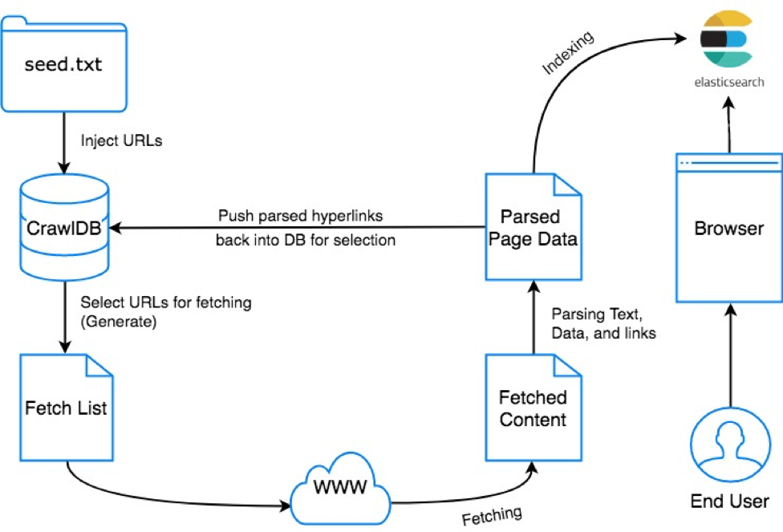

# General
Nutch is open-source, scalable, production-ready web crwaler based on Apache Hadoop (data structure) and Apache Gora (data storage). In this custom image of [Apache Nutch](http://nutch.apache.org/), we're using HBase as storage and Elasticsearch indexing. 

The crawl cycle consist of 6 steps, Inject, Generate, Fetch, Parse, Updatedb, and Index. Injected URLs from seed will be stored in CrawlDB, and each will be scraped. Then it fetch and parse all scraped content and hyperlinks to store them back into CrawlDB. Lastly those parsed content will be injected into indexing backend.



# How to Run 
1. Create directory `nutch_source/urls` with `seed.txt` of urls
2. Run docker-compose up
3. The exposable port are:
  - Nutch webbapp in localhost:9500
  - Elasticsearch endpoint in localhost:9200
4. We recommend go to [Nutch 2.x tutorial](http://wiki.apache.org/nutch/Nutch2Tutorial), after familiar enter the container by 
```
docker exec -it pln-temp_nutch_1 /bin/bash
nutch inject urls/
nutch generate -topN 10
nutch fetch -all
nutch parse -all
nutch updatedb -all
nutch index -all
```

Happy Crawling! 
